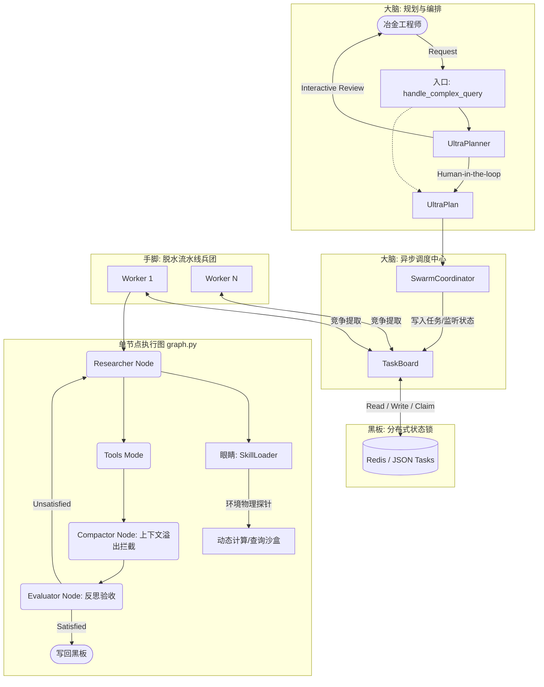
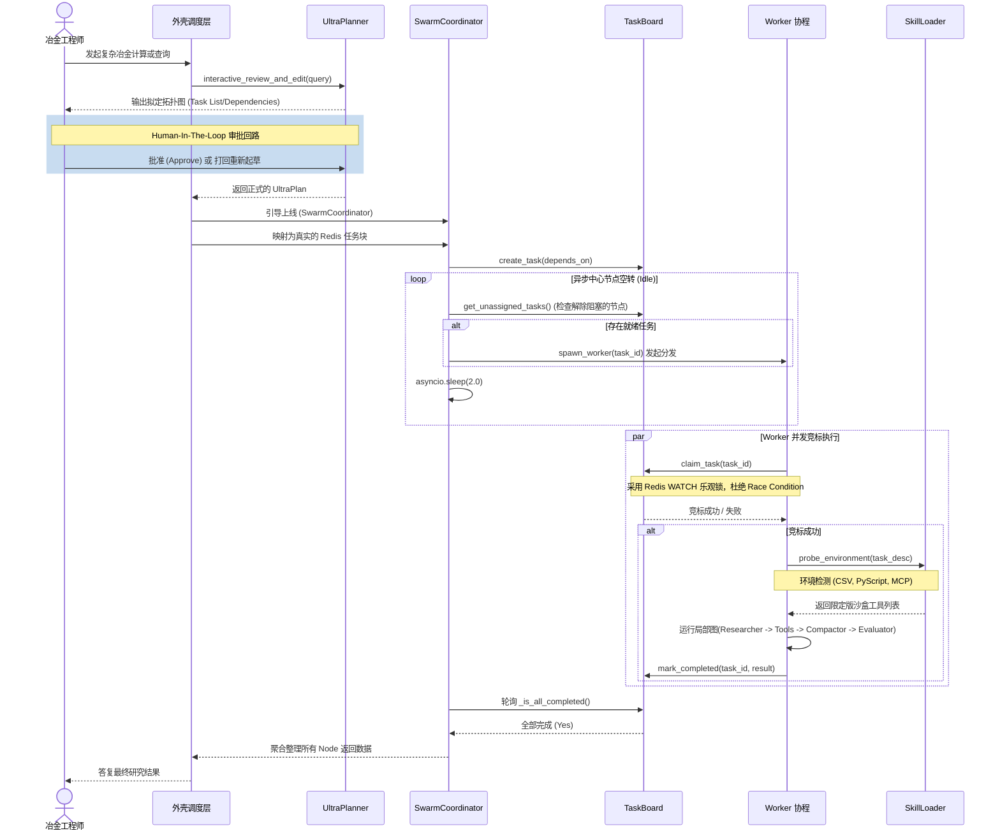
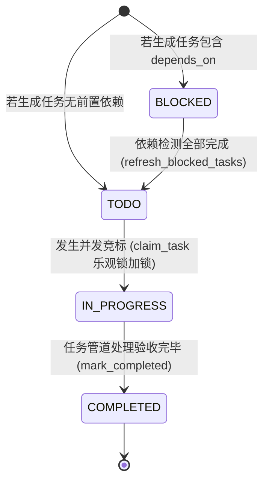
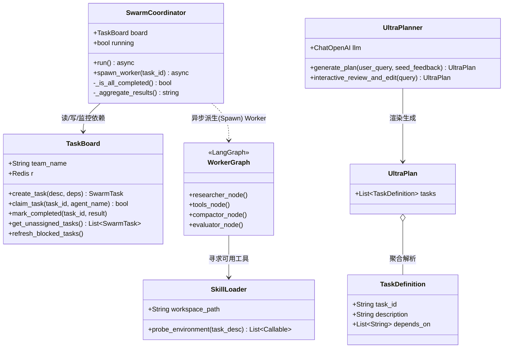

# Xiaoye Agent - 架构 UML 建模报告

基于 `HANDOVER_PROMPT.md` 与核心代码（`swarm_coordinator.py`, `task_board.py`, `graph.py`, `skill_loader.py`, `ultraplan.py`），以下是提炼自项目当前实现的架构 UML 建模报告。平台整体参考了 Anthropic Claude Code 的设计哲学，从传统的 Monolithic (全局状态循环) 升级为真正的多智能体异步 Swarm 体系。

## 1. 核心架构拓扑 (Component Diagram)
该图表展示了系统各个组件之间的功能划分与流向，重点突出了基于“黑板模式 (Blackboard)”的解耦通信设计和启发式技能挂载机制。

## 2. 核心工作流与运行生命周期 (Sequence Diagram)
展现了一次复杂查询从解析到规划，再到黑板拆解发包、各路 Worker 抢占式执行、验证汇总的完整时序逻辑。

## 3. 任务状态机定义 (State Diagram)
体现基于依赖图的 `SwarmTask` 生命周期流转机制。借助依赖图，复杂流程可以像 DAG 一样逐步解冻执行。

## 4. 核心类图逻辑关系 (Class Diagram)
展示代码内部各定义类的关联方式和核心职责方法：

## 5. 架构分析与建议 (Architectural Insight)

从目前的架构来看，它精准且优雅地匹配了 Handover Prompt 中提到的改造目标：

1. **分布式安全 (Fault Tolerance)**: 打破 LangGraph 原生 `AgentState` 大内存循环。单个 Worker 死循环、报错或上下文 Token 爆满，**不会拖垮整体流程**，可以通过 Coordinator 回收任务重新下发。
2. **算力精准集约 (Resource/Microcompact)**: **Skill Loader** 摒弃了大模型传统的巨大 Prompt API 头，按需扫描文件夹探针。**Compactor** 实现了粗暴但高容错的内容“墓碑 (Tombstone)”截断。
3. **人类控制权 (Human-in-the-Loop)**: `UltraPlanner` 在 Swarm 激活之前插入了一个拦截点，方便高级工程师调整与拒绝错误拓扑。

### 接下来可落地的工程推进点：
- **Redis 方案实装**: 当前的代码混杂着部分注释 mock `Redis Pipeline` 事务原型，确保证明 `claim_task()` 是完全防并发竞争（TOCTOU）的，可稳定承接下一代微服务 Celery / K8s Job 分发。
- **Agent-to-SQL DB 沙盒支持**: 下行规划中的结构化查询工具亟需将 `create_db.py` 链接到 `SkillLoader._mock_sql_agent_tool` 真正跑通实体代码。
