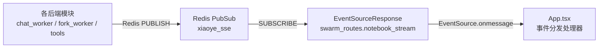

# SSE 事件规范 (Server-Sent Events)

> **Redis 频道**: `xiaoye_sse` | **端点**: `GET /api/v1/notebook/stream` | **传输格式**: JSON 行

---

## 一、事件路由流程



---

## 二、事件类型一览

| # | type 字段值 | 生产者 | 前端处理 |
|---|-----------|--------|---------|
| 1 | (无 type) / `chat_patch` | `sse_channel.async_publish_chat_patch` | 追加 patch 到 notebookContent |
| 2 | `reasoning` | `run_worker_pipeline` / `_stream_vlm_response` | 追加到 thinkingContent，自动展开面板 |
| 3 | `fork_start` | `dispatch_fork_subagent` | 插入 `` Markdown |
| 4 | `retrieval_sources` | 检索工具调用后 | 更新 retrievalSources state |
| 5 | `ask_user` | Agent AskUserTool | 弹出 AskUserModal |
| 6 | `content` | `fork_worker._stream_vlm_response` | VLM 流式内容追加 |
| 7 | `tool_feedback` | (内嵌于 chat_patch 的 `> 🛠️` 消息) | separateStatusAndBody 分离显示 |

---

## 三、事件详细定义

### 1. chat_patch — 聊天内容增量

```json
{"task_id": "session_123", "patch": "马氏体(Martensite)是..."}
```
- **触发**: `run_worker_pipeline` 每次 LLM token 输出，或工具调用状态通知
- **含义**: `patch` 字段直接追加到当前会话的 notebook 内容
- **约定**: 首个 patch 到来时，前端将占位符 `*…小冶思考中...*` 替换为 `---` 分隔符
- **Publish 位置**: `sse_channel.async_publish_chat_patch(task_id, chunk.content)`

### 2. reasoning — 思维链

```json
{"type": "reasoning", "task_id": "session_123", "thinking": "我需要先查询马氏体相变的基本定义..."}
```
- **触发**: qwen-max 在 deep_mode 下返回的 `chunk.thinking` 字段（阿里云 DashScope 通义千问扩展）
- **前端行为**: 追加到 `thinkingContent` state → 自动设置 `showThinking=true` → ReactMarkdown 渲染
- **与正文分离**: `run_worker_pipeline` 中通过 `chunk.thinking` vs `chunk.content` 字段区分

### 3. fork_start — Fork 选区截图

```json
{"type": "fork_start", "task_id": "task_abc", "image_url": "/api/images/task_abc.png", "patch": "📷 选区截图已捕获 (12345 bytes)"}
```
- **触发**: `dispatch_fork_subagent` 在裁剪图片并保存后，启动模式处理前
- **前端行为**: 拼接完整 URL `http://localhost:8000{image_url}` → 插入 `` Markdown → ReactMarkdown 渲染为 ``
- **时序**: fork_start 是所有 Fork 分析中第一个到达的 SSE 事件

### 4. retrieval_sources — 检索来源推送

```json
{"type": "retrieval_sources", "task_id": "session_123", "sources": [
  {"doc_id": "abc", "filename": "paper.pdf", "pages": [3,5], "score": 0.92, "chunk_type": "text"}
]}
```
- **触发**: 检索工具（SemanticSearchTool / HyDESearcher）返回结果时
- **前端行为**: `setRetrievalSources(sources)` → Sidebar 组件展示命中文献名和页码，用户可点击跳转到对应 PDF 页面

### 5. ask_user — 反询问用户

```json
{"type": "ask_user", "task_id": "session_123", "ask_id": "ask_uuid_001", "question": "请问您想了解哪种具体的热处理工艺？淬火、回火还是退火？"}
```
- **触发**: Agent 在信息不足时调用 AskUserTool
- **前端行为**: 设置 `askUserEvent` state → 弹出 `AskUserModal` 弹窗 → 用户输入回复 → `POST /api/v1/ask_user/reply` → 继续执行

### 6. tool_feedback — 工具反馈

工具调用状态通知以内嵌方式合并在 `chat_patch` 事件中，格式为 `\n\n> 🛠️ **正在调用工具检索...** (`tool_name`)\n`。前端 `separateStatusAndBody()` 函数将此类消息提取到 `.tool-status-log` 区域。

### 7. content — Fork VLM 内容

```json
{"task_id": "task_abc", "type": "content", "patch": "该图显示的是典型的马氏体板条组织..."}
```
- **触发**: `_stream_vlm_response` 流式输出 VLM 分析结果
- **与 chat_patch 区别**: 带有 `type: "content"` 标识符，后端 Fork 模块直接操作 Redis（不通过 SSEChannel）
- **前端行为**: 由 `data.patch` 分支统一处理，追加到 notebookContent

---

## 四、Redis PubSub 频道

- **频道名**: `xiaoye_sse`
- **消息格式**: JSON 字符串，每个消息由 `redis_client.publish("xiaoye_sse", json.dumps(payload))` 发送
- **订阅端**: `swarm_routes.py` 的 `notebook_stream` 异步生成器，通过 `pubsub.get_message(timeout=1.0)` 循环拉取
- **断连处理**: `request.is_disconnected()` 检测 → 自动 `unsubscribe` → `asyncio.CancelledError` 优雅退出

---

## 五、消息隔离机制

所有事件均携带 `task_id` 字段。前端 SSE 处理器**不按 task_id 过滤**（当前为单会话模式），直接将所有事件追加到活跃的 `notebookContent` 和 `thinkingContent`。未来多窗口支持时，需在 `onmessage` 处理器中添加 `if (data.task_id !== currentSessionId) return;` 过滤逻辑。
