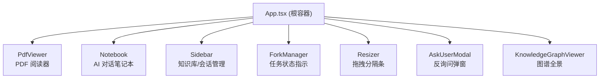

# 前端架构设计

> **版本**: v1.0 | **维护者**: 小冶团队 | **最后更新**: 2026-05

---

## 一、三栏布局

```
┌──────────────┬──────────────────────────┬──────────────┐
│              │                          │              │
│   📄 阅读器   │    🧠 小冶助手            │   📚 知识库   │
│  (PdfViewer) │    (Notebook)            │  (Sidebar)   │
│              │                          │              │
│  左栏 33%    │    中栏 flex:1           │  右栏 24%    │
│  (可拖拽)    │    (自适应填充)           │  (可拖拽)    │
│              │                          │              │
└──────────────┴──────────────────────────┴──────────────┘
     ▲ Resizer      ▲ Resizer                  ▲ Resizer
  左栏拖拽分隔条   右栏拖拽分隔条              折叠/展开按钮
```

- **宽度约束**: 左栏 10%-75%，右栏 10%-75%，中栏最小 200px，拖拽时中栏不小于 15%
- **折叠机制**: CSS `flex-basis` 过渡动画（0.25s cubic-bezier），折叠时 `flex: 0 0 0px`，展开时恢复 `prevWidth` ref 记忆值
- **布局持久化**: `localStorage` 键 `xiaoye_layout_v2`，仅在非折叠态写入

---

## 二、组件树



- **状态提升**: `App.tsx` 持有全部核心状态（`notebookContent`, `thinkingContent`, `deepMode`, `retrievalSources`, `currentSessionId`），通过 props 向下传递和回调向上冒泡
- **PDF 来源区分**: `PdfViewer` 接收 `sourceType: 'uploaded' | 'retrieved'`，上传文档显示蓝色半透明底纹（`rgba(99,102,241,0.06)`），检索文献无底纹

---

## 三、SSE 事件消费

App.tsx 通过 `EventSource("/api/v1/notebook/stream")` 建立 SSE 长连接，`onmessage` 处理器按优先级路由 7 种事件类型：

| 优先级 | 事件类型 | 判断条件 | 前端行为 |
|--------|---------|---------|---------|
| 1 | `ask_user` | `data.type === 'ask_user' && data.ask_id` | 弹出 AskUserModal，暂停 Agent 等用户回复 |
| 2 | `retrieval_sources` | `data.type === 'retrieval_sources' && data.sources` | 更新 `retrievalSources` state，Sidebar 显示命中文献列表 |
| 3 | `fork_start` | `data.type === 'fork_start' && data.image_url` | 在 notebook 中插入 `` Markdown |
| 4 | `reasoning` | `data.type === 'reasoning' && data.thinking` | 追加到 `thinkingContent`，自动展开思维链面板 |
| 5 | `chat_patch` | `data.patch` 存在 | 追加到 `notebookContent`，首个 patch 将占位符 `*…小冶思考中...*` 替换为 `---` 分隔符 |

---

## 四、Notebook 消息气泡解析

**分隔规则**: `\n---\n` 分隔不同消息段；以 `**👤 您:**` 开头的为**用户消息**，其余为 **AI 回复**。

```typescript
// parseMessages() 核心逻辑
segments = raw.split(/\n---\n/).filter(s => s.trim())
  → trimmed.startsWith('**👤') → { role: 'user', content: userText }
  → 否则 → { role: 'assistant', content: trimmed }
```

**气泡渲染**: 用户消息右对齐（`flex-end`），AI 回复左对齐（`flex-start`），各有独立 CSS 类 `chat-bubble-user` / `chat-bubble-assistant`。最后一条 AI 消息在流式输出期间追加 `<span className="typing-cursor" />` 闪烁光标。

---

## 五、思维链折叠面板

- **状态**: `showThinking: boolean`，初始 `false`，新 `thinkingContent` 到达时自动展开
- **动画**: CSS `max-height` transition，`.thinking-content-panel` 从 `max-height: 0` 切换到 `max-height: 600px`（类 `.open`）
- **内容渲染**: `thinkingContent` 经过与正文相同的 `preprocessLatex → ReactMarkdown` 管线

---

## 六、LaTeX 渲染管线

```
raw Markdown text
  → preprocessLatex(): \[...\]→$$...$$, \(...\)→$...$
  → ReactMarkdown
    → remarkPlugins: [remarkGfm, remarkMath]   // GFM + 数学公式 AST
    → rehypePlugins: [rehypeKatex]              // AST → KaTeX HTML
  → KaTeX CSS (katex/dist/katex.min.css)
```

---

## 七、深度模式切换

- **触发**: Notebook 底部 `🧠 深度` 按钮，toggle `deepMode` state
- **视觉**: 深度模式激活时蓝色脉冲指示点 + 蓝色边框/背景（`rgba(59,130,246,0.15)`）
- **透传**: `handleUserChat(message, deepMode)` → `POST /api/v1/chat` body 携带 `deep_mode: true`
- **后端链路**: `ChatRequest.deep_mode` → `dispatch_chat_worker(deep_mode=True)` → `run_worker_pipeline(deep_mode=True)` → qwen-max+thinking + HyDE 增强检索

---

## 八、PDF 选区交互

```
左键按下(mousedown) → 拖拽(mousemove) → 释放(mouseup)
  → 绘制选区矩形框 (drawing-box / rendered-box)
  → 右键(contextmenu) → 弹出菜单:
      🔬 直接解析 → dispatchFork('analyze_region')
      🧠 深度科研 → dispatchFork('deep_research')
```

**坐标归一化**: `BoundingBox {x0,y0,x1,y1}` 为容器相对坐标（0-1），`pageNumber` 来源于当前页码。传入后端后由 `crop_pdf_to_base64_png` 根据 `2x zoom` 反算物理坐标。

---

## 九、工具状态日志分离

`separateStatusAndBody()` 函数按行扫描，将满足以下模式的行抽离为 `statusText`：
- `> 🔍`, `> ⚙️`, `> 🧪`, `> 📊`, `> 🔄`, `> 🛠️` 开头
- 纯 `*…正在…*` 模式的工具状态行
- 连续空行（在工具日志段内）

日志段渲染为 `.tool-status-log` 样式（浅色、小号字体），正文段正常渲染。
