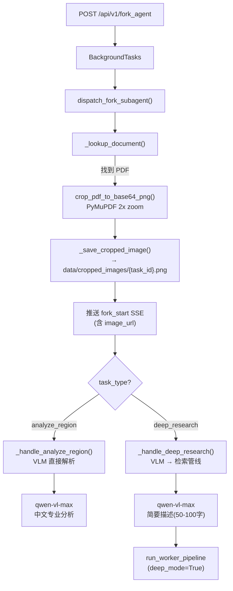

# Fork 子代理设计 (Fork Subagent)

> **文件**: `src/delivery/fork_worker.py` | **设计灵感**: Claude Code `forkSubagent.ts` | **版本**: v1.0

---

## 一、架构总览



---

## 二、双模式对比

| 维度 | analyze_region | deep_research |
|------|---------------|---------------|
| **前端触发** | 右键菜单 `🔬 直接解析` | 右键菜单 `🧠 深度科研` |
| **VLM 模型** | `qwen-vl-max` | `qwen-vl-max` |
| **VLM Prompt** | 详细中文分析（图片类型+数据+冶金解读+研究意义） | 简要描述（类型+特征+含义，限 50-100 字） |
| **后续处理** | VLM 结果直接推送至 SSE | VLM 结果注入 task_description → 启动检索管线 |
| **检索管线** | 不启动 | `run_worker_pipeline(deep_mode=True)` |
| **回答深度** | 视觉级别 | 知识库增强级别（含具体数据和来源引用） |

---

## 三、直接解析流程 (analyze_region)

```
1. VLM 调用: qwen-vl-max, streaming=True
2. 系统提示词: SYSTEM_ANALYZE ("冶金学视觉分析专家，以中文直接输出")
3. 用户提示词: PROMPT_ANALYZE (4 维度分析: 图片类型/关键数据/冶金解读/研究意义)
4. 流式输出: _stream_vlm_response() → SSE type="content"
5. 结果保存: Redis SET xiaoye:chat:{task_id} ← 完整 VLM 回复
```

**结果用途**: 保存的 VLM 分析结果后续被 `chat_worker.dispatch_chat_worker` 读取，作为"VLM 上下文模式"的上下文基础，支持用户在分析结果上的追问。

---

## 四、深度科研流程 (deep_research)

```
Step A — VLM 快速预分析:
  _stream_vlm_response(llm=qwen-vl-max, system=SYSTEM_DEEP, prompt=PROMPT_DEEP_RESEARCH)
  推送 SSE type="content"

Step B — 构建研究上下文:
  成功: 将 VLM 结果包装为 [视觉分析上下文] + [任务] 段落
  失败: 降级为纯文本检索模式 "图片分析不可用"

Step C — 启动检索管线:
  run_worker_pipeline(payload={"task_description": ..., "deep_mode": True}, task_id)
  → 触发 Researcher → Tools(ES+KG+HyDE) → Compactor → Synthesizer
```

**降级策略**: VLM 异常（网络错误/超时）时，task_description 自动降级为 `"图片分析暂时不可用\n用户选中了论文中的一张图/表。请基于知识库文献，搜索可能相关的冶金学知识。"`，确保管线不中断。

---

## 五、图片裁剪与静态服务

**裁剪**: `src/tools/pdf_cropper.py` → `crop_pdf_to_base64_png(pdf_path, page_number, bbox)`
- 使用 PyMuPDF (`fitz`) 渲染页面为 `2x zoom` 高分辨率图像
- 根据前端归一化的 `bbox {x0,y0,x1,y1}` 反算物理像素坐标区域
- 返回 base64 PNG 字符串

**持久化**: `_save_cropped_image(img_b64, task_id)` → `data/cropped_images/{task_id}.png`

**静态服务**: FastAPI `mount("/api/images", StaticFiles(directory="data/cropped_images"))`，前端通过 `` 渲染

---

## 六、SSE 事件流

```
dispatch_fork_subagent() 生命周期中的 SSE 推送:

1. fork_start:  {type:"fork_start", task_id, image_url:"/api/images/x.png", patch:"📷 选区截图已捕获"}
2. VLM stream:  {type:"reasoning", task_id, thinking:"..."}   ← qwen-vl-max 思维链
                {type:"content",   task_id, patch:"..."}      ← VLM 分析文本
3. Retrieval:   {task_id, patch:"🧠 启动深度知识库检索..."}   ← 仅 deep_research
4. Synthesizer: {type:"reasoning", ...} / {type:"content", ...}  ← 检索管线流式输出
5. 结束分隔符:   {task_id, patch:"\n\n---\n"}
```

---

## 七、与推理管线的集成

Fork 子代理与推理管线共享：
- **同一 Redis SSE 频道**: `xiaoye_sse`，通过 `task_id` 隔离消息
- **同一管线引擎**: `src.reasoning.graph.run_worker_pipeline()`
- **工具注册表**: `src.tooling.registry.get_tool_registry()`

**禁止子代理递归**: 遵循 Claude Code `forkSubagent.ts` 原则 — Fork 启动的 Worker 绝对不允许再调用 AgentTool 创建新的子代理。
