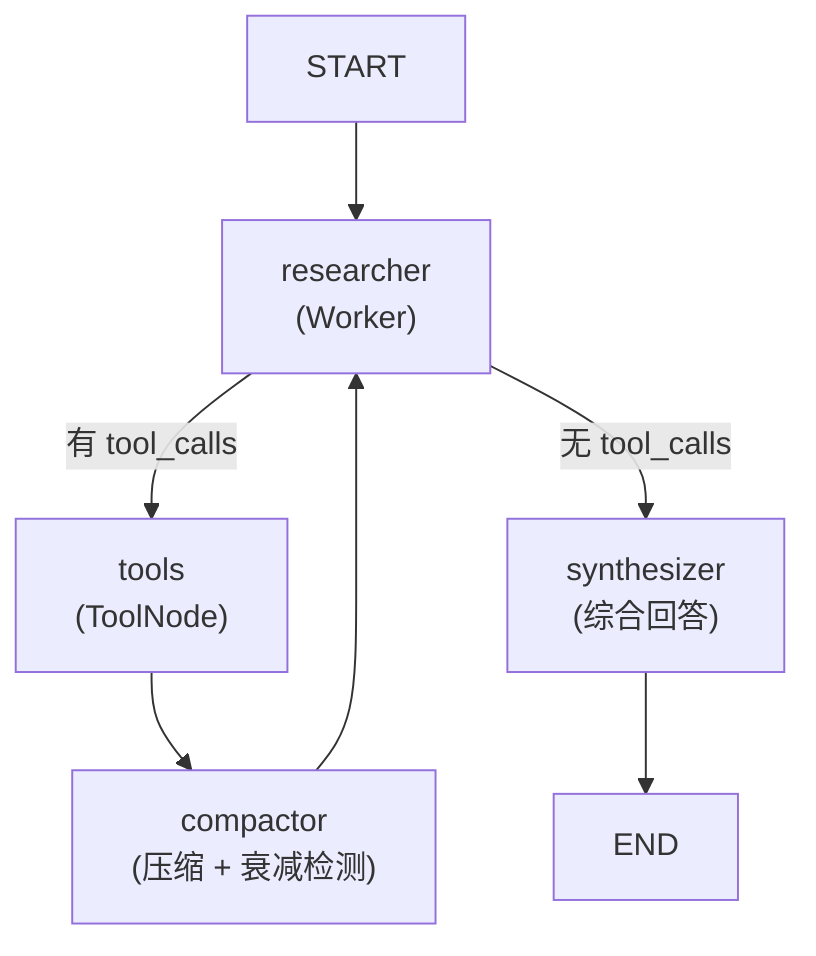

# 推理管线设计 (Reasoning Pipeline)

> **文件**: `src/reasoning/graph.py` | **版本**: M5 简化版 | **最后更新**: 2026-05

---

## 一、图结构总览



**4 节点设计**（移除 Evaluator，消除 LLM-as-judge 开销）：
- `researcher` — 任务执行者，单轮调用工具或直接回答
- `tools` — LangGraph `ToolNode`，执行工具调用
- `compactor` — 截断工具输出 + 检测衰减收益
- `synthesizer` — 汇总所有工具输出，生成最终综合回答（不调用工具）

---

## 二、模型分级 (Model Tiering)

| 模式 | 模型 | 配置 | 适用场景 |
|------|------|------|---------|
| **FAST** (默认) | `qwen-turbo` | temperature=0.2, 无 thinking | 日常问答、基础检索 |
| **DEEP** | `qwen-max` | temperature=0.2, `thinking: {type:auto, budget:32000}` | 深度科研、Fork 子代理 |

通过 `create_worker_graph(deep_mode: bool)` 工厂函数动态构建，deep_mode 来自：
- 前端 `ChatRequest.deep_mode` → `chat_worker.dispatch_chat_worker`
- Fork 子代理 `_handle_deep_research` 硬编码 `deep_mode=True`

---

## 三、Researcher 节点 — Claude Code 哲学

```python
sys_prompt = """
【自主决策原则】：你就是决定何时停止检索的人。
如果已有足够资料回答，立即停止调用工具，直接给出答案。
宁可给出有据可查的不完整回答，也不要为了'完美匹配'反复搜索。
"""
```

**四条核心约束**:
1. 检索命中主题相关内容即可，不穷举所有搜索词
2. 空结果后禁止相同关键词重试，改用同义词或自然语言疑问句
3. 同一工具不得连续调用超过 2 次
4. 资料足够即停止，直接给答案

---

## 四、衰减收益检测 (Diminishing Returns)

**Compactor 节点** 对最近两次 `ToolMessage` 执行字符级 Jaccard 相似度计算：

```python
set_last = set(last_text[:400])
set_prev = set(prev_text[:400])
overlap = len(set_last & set_prev) / len(set_last | set_prev)
if overlap > 0.5:  # 注入停止信号
    updates["messages"] = [HumanMessage("[系统干预] 最近两次检索高度相似…")]
```

触发后注入的 `[系统干预]` 消息在下轮 Researcher 执行时被拼入 `feedback` 字段，强制模型停止检索并直接回答。

---

## 五、安全网机制

- **maxTurns=12**: `MAX_REACT_LOOPS = 12`，极限 12 轮迭代（researcher→tools→compactor 循环），触发后强制注入 `[系统干预] 已达最大检索次数` 信号
- **递归深度**: `config={"recursion_limit": 50}` 防止 LangGraph 无限递归
- **内容截断**: 单次工具输出超过 3000 字符自动截断，附带原始长度提示

---

## 六、Synthesizer 综合回答

- **模型**: `llm_without_tools`（同模型，不绑定工具）
- **强制约束**: 不少于 500 字 + 来源引用格式 `[来源: xxx.pdf, p.X]`
- **输入**: 所有历史 ToolMessage 拼接为 `\n\n---\n\n` 分隔的资料汇总块
- **输出方向**: 仅输出最终回答，不调用工具

---

## 七、run_worker_pipeline — 流式执行引擎

```python
async def run_worker_pipeline(payload: dict, task_id: str) -> str:
    graph = create_worker_graph(deep_mode=deep_mode)
    state = {"messages": [SystemMessage(content=task_description)], ...}

    async for event in graph.astream_events(state, version="v2"):
        if kind == "on_chat_model_stream":
            # 分离 thinking（qwen-max 思维链）与 content（正文）
            if chunk.thinking → sse.publish("reasoning", ...)
            if chunk.content  → sse.publish("chat_patch", ...)

        elif kind == "on_tool_start":
            # 推送工具调用通知
            sse.publish_chat_patch("🛠️ 正在调用工具检索...")
```

**核心职责**: 驱动 LangGraph `astream_events` v2，实时分离流式输出中的思维链与正文，通过 SSEChannel 推送到 `xiaoye_sse` 频道。

---

## 八、与 Fork 子代理的关系

| 调用方 | 调用方式 | deep_mode |
|--------|---------|-----------|
| `chat_worker.dispatch_chat_worker` | 直接调用 | 由前端传入 |
| `fork_worker._handle_deep_research` | VLM 预分析 → 构建 task_description → 调用 | 硬编码 True |

Fork 深度科研复用同一 `run_worker_pipeline`，唯一区别是 payload 的 task_description 中包含 VLM 视觉分析上下文。两者共用同一个 Redis SSE 频道，通过 `task_id` 隔离消息。
