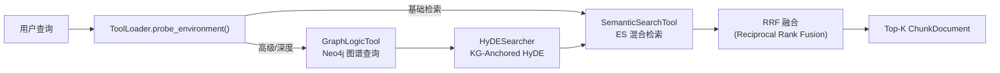
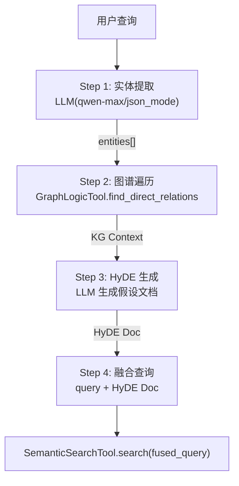

# 检索管线设计 (Retrieval Pipeline)

> **模块**: `src/retrieval/` | **版本**: v1.2 | **最后更新**: 2026-05

---

## 一、检索架构总览



三层检索策略渐进加载：
- **快速模式**: 仅 SemanticSearchTool（ES 向量+BM25）
- **深度模式**: ToolLoader 探测环境 → 挂载 HyDESearcher → KG 增强 → ES

---

## 二、SemanticSearchTool — ES 混合检索

**索引**: `metallurgy_chunks`（来源字段: `chunk_id, doc_id, content, source_type, page_number, bbox, image_uri, chunk_type`）

**双路检索流程**:

```
查询文本
  │
  ├── QueryBuilder.build_es_query(query)
  │     → token_merge + 引号转义 → ES DSL (BM25 query_string)
  │     → 词法检索 (lexical_hits), size=top_k*2
  │
  └── OpenAIEmbeddings.embed_query(query)
        → KNN 向量检索, field="vector", k=candidate_pool_size
        → 语义检索 (vector_hits), size=top_k*2
  │
  └── HybridScorer.reciprocal_rank_fusion(lex, vec, k=60)
        → RRF 公式: score = Σ 1/(k + rank_i)
        → 取 Top-K → ChunkDocument.from_es_hit()
```

---

## 三、RRF 融合公式

```
RRF(d) = Σ_{i ∈ {lexical, vector}}  1 / (k + rank_i(d))
```
- `k = 60`（平滑参数，降低排名翻转敏感性）
- 两路各取 `top_k * 2` 候选项，RRF 后取 `top_k` 最终结果

---

## 四、GraphLogicTool — Neo4j 图谱查询

| 方法 | 功能 | Cypher 模式 |
|------|------|------------|
| `find_direct_relations(entity, direction)` | 查实体直接关系 | `MATCH (s {id})-[r]-(o)` |
| `trace_impact_path(start_entity, max_hops)` | 多跳因果链追踪 | `MATCH p=(start)-[*1..n]->(end)` |

- **标准化**: `_normalize_entity()` 将输入转为小写+下划线（`"Grain Boundary" → "grain_boundary"`）
- **关系属性**: 每个关系携带 `mechanism`（机理）、`context`（上下文）、`source_doc`（来源文献）

---

## 五、HyDESearcher — KG-Anchored HyDE 管线



**关键设计**:
- 实体提取限 3 个实体，每个实体限 10 条关系 — 防止图谱爆炸
- HyDE 文档与原始查询 `fused_query = f"{query}\n\n{hyde_doc}"` 混合检索 — 防止语义漂移
- 工厂方法 `HyDESearcher.create_fast()` 提供 qwen-turbo 加速模式

---

## 六、page_number 提取机制

ES 索引中每个 chunk 存储 `page_number` 字段，来源于 PDF 解析时的 TOC（目录）匹配。检索命中后，`ChunkDocument.from_es_hit()` 将其反序列化，供 Synthesizer 标注来源页码 `[来源: xxx.pdf, p.12]`。

---

## 七、BM25 查询构建 (QueryBuilder)

源自 RAGFlow sandbox 的 `core_components/nlp/query_builder.py`：
- **Token Merge**: 合并同义词、上位词、下位词，生成扩展关键词列表
- **引号转义**: 保护专有名词短语不被 ES 分词器拆分（如 `"dual-phase steel"` → `\"dual-phase steel\"`）
- 输出: `(es_dsl: dict, keywords: list)` — 前者用于 ES `query_string`，后者用于日志

---

## 八、工具渐进加载 (ToolLoader)

`src/tooling/loader.py` 的 `ToolLoader.probe_environment(task_description)` 在 Researcher 节点每轮执行前探测环境，决定挂载哪些检索工具：

```
基础工具 (始终挂载):
  - SemanticSearchTool  (ES 混合检索 → search_metallurgy_text)
  - GraphLogicTool      (Neo4j 图谱 → search_metallurgy_graph)

高级工具 (search_available_tools 动态挂载):
  - HyDESearcher        (KG-Anchored HyDE 增强)
  - AskUserTool         (向用户反询问 → 仅在深度模式)
```
